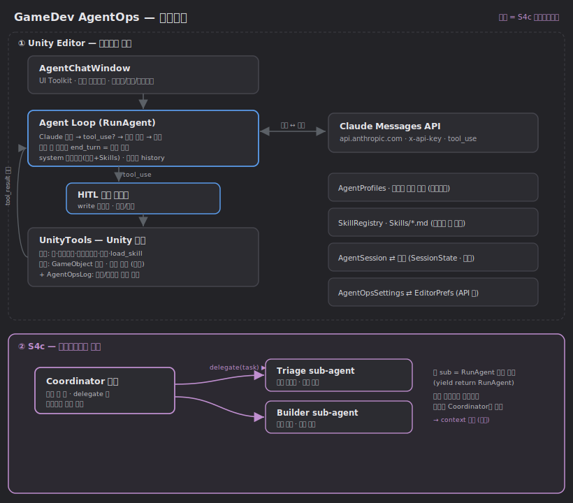
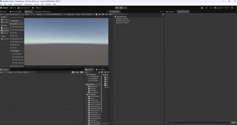

# GameDev AgentOps

> **Unity Editor 안에서 도는 AI 에이전트를 외부 프레임워크 없이 바닥부터 구현한 프로젝트.**
> Anthropic Claude Messages API를 직접 호출해 tool_use 루프·멀티에이전트 위임·HITL 승인까지 손으로 짰습니다.


> 위 데모: **Coordinator** 모드에서 한 번의 요청으로 — Triage가 씬을 분석하고, Builder가 GameObject 생성·컴포넌트 부착까지 위임받아 처리한다. 모든 쓰기는 **사용자 승인(HITL)** 을 거치고, 결과는 Coordinator가 종합한다.

---

## 📌 한눈에

| 항목 | 내용 |
|------|------|
| **무엇** | Unity 에디터에 통합된 게임 개발용 AI 에이전트 — 씬·로그를 읽고 GameObject·컴포넌트를 **실제로 생성·수정** |
| **어떻게** | Claude API **직접 호출** + **직접 구현한** 에이전트 루프 (LangChain·MAF 등 에이전트 프레임워크 미사용) |
| **차별점** | 에디터 *밖*의 코딩 도구와 달리 Unity의 살아있는 맥락(열린 씬·콘솔·선택 에셋)에 직접 접근하고, 도구로 **씬을 바꾼다** |
| **규모** | C# · Unity Editor · 도구 13개(읽기 8/쓰기 5) · 3종 역할 모드 · 멀티에이전트 |

**한 줄 피치:** *"Claude API를 직접 호출하는 에이전트 루프를 바닥부터 구현해, Unity 에디터 안에서 멀티에이전트가 씬을 진단·조작하도록 만든 프로젝트."*

---

## 🎯 어필 포인트 — 이 프로젝트로 증명하는 역량

| # | 역량 | 무엇으로 보여주나 |
|---|------|------------------|
| 1 | **원리 이해 (프레임워크 의존 X)** | Agent Loop·`tool_use` 프로토콜·SSE 스트리밍을 직접 구현. "도구를 쓸 줄 안다"가 아니라 **"내부가 어떻게 도는지 안다"** |
| 2 | **멀티에이전트 설계** | Coordinator가 작업을 분해해 Triage/Builder에 위임 → **중첩 코루틴**으로 sub-agent 실행 → **context 격리**(더러운 일은 sub가, 결론만 회수) |
| 3 | **안전한 자동화 (production sense)** | 모든 쓰기 작업에 **HITL 승인 게이트** + 역할별 **최소 권한**(읽기전용 모드엔 쓰기 도구가 *존재하지 않음*) + 파일 **경로 샌드박스** |
| 4 | **회복력 엔지니어링** | 429/529/5xx **지수 백오프 재시도**, 빈 메시지 가드(잘못된 400 방지), **도메인 리로드를 넘어 생존하는** 세션 영속 |
| 5 | **엔진 통합 깊이** | UI Toolkit 채팅 UI, `EditorCoroutine`로 비동기 처리, **리플렉션**으로 컴포넌트/타입을 동적 해석·조작 |
| 6 | **문제 해결 기록** | [문제→원인→해결 로그](docs/learning-journey.md): HTTP 상태코드 진단표, SDK 버전 불일치 대응, 코루틴/이벤트 처리 함정 등 |

---

## 🧩 핵심 구현 (기술 깊이)

**에이전트 루프 (`tool_use`)** — 매 턴 `messages`를 키워 Claude 호출 → `stop_reason == "tool_use"`면 도구 실행 후 `tool_result`를 다음 user 턴으로 회신 → 반복. `max_tokens`·무한루프 가드까지 직접 관리.

**멀티에이전트 위임** — `delegate` 도구의 *실행*이 곧 또 하나의 에이전트 루프(`yield return RunAgent(subSession, subProfile, …)`). sub-agent는 독립 세션·프로필로 작업하고 **결론만** 반환 → 메인 컨텍스트를 깨끗하게 유지. sub 프로필엔 `delegate`가 없어 **위임 깊이 1단계로 제한**.

**스트리밍 (SSE)** — `DownloadHandlerScript`를 상속한 파서로 `content_block_delta`를 실시간 표시하면서, `content_block_start`/`input_json_delta`/`message_delta`로 **tool_use·stop_reason을 재구성**해 루프에 넘김.

**권한 모델 (이중 게이트)** — ① **도구 존재**: 모드별 허용 목록으로 필터(읽기전용 모드는 쓰기 도구를 아예 못 봄) ② **실행 승인**: 쓰기 도구는 코루틴을 멈추고 사용자 결정을 대기. 승인 정책(쓰기만 확인/전부 자동/전부 확인) 선택 가능.

---

## 🧠 동작 방식



<sub>① 에이전트 코어(파랑): 채팅창 → Agent Loop ↔ Claude API → 도구, HITL 승인·프로필·Skills·세션영속 · ② 멀티에이전트(보라): Coordinator가 Triage/Builder sub-agent에 위임</sub>

<details><summary>텍스트 요약 다이어그램</summary>

```
┌────────────────────── Unity Editor ──────────────────────┐
│                                                          │
│   채팅 UI (UI Toolkit)        Unity 컨텍스트/도구          │
│   ┌──────────────┐           ┌───────────────────────┐   │
│   │ 질문 / 명령  │──────────▶│ 씬·로그·에셋·컴포넌트  │   │
│   └──────┬───────┘           └───────────▲───────────┘   │
│          │                                │ (도구 실행)   │
│          ▼                                │              │
│   ┌──────────────────────────────────────┴───────────┐  │
│   │   에이전트 루프 (요청 → tool_use → 결과 → 반복)    │  │
│   └──────────────────────┬───────────────────────────┘  │
└──────────────────────────┼──────────────────────────────┘
                           │ x-api-key (EditorPrefs)
                           ▼
                 Anthropic Claude Messages API (SSE 스트리밍)
```

</details>

---

## 🧰 에이전트 도구

### 읽기 도구 — 자동 실행 (승인 불필요)
| 도구 | 설명 |
|------|------|
| `read_active_scene` | 활성 씬의 GameObject 계층(트리) |
| `find_gameobjects` | 이름·컴포넌트 타입으로 검색 (비활성 포함) |
| `inspect_gameobject` | 오브젝트 상세 — 경로·활성·태그·레이어·Transform·컴포넌트 |
| `read_console_logs` | 콘솔 로그(런타임 Debug/경고/에러) |
| `get_compile_errors` | 스크립트 컴파일 에러 목록 |
| `read_text_file` | `Assets/` 밑 텍스트·스크립트 읽기 (경로 샌드박스) |
| `load_skill` | 작업별 상세 지침(Skill) 로딩 |
| `delegate` | 전문 sub-agent에 작업 위임 (Coordinator 전용) |

### 쓰기 도구 — 사용자 승인(HITL)
| 도구 | 설명 |
|------|------|
| `create_gameobject` | 빈 GameObject 생성 |
| `create_primitive` | 보이는 도형 생성 (Cube/Sphere/Capsule/Cylinder/Plane/Quad) |
| `set_primitive_mesh` | 기존 오브젝트를 도형 모양으로 보이게 (MeshFilter·MeshRenderer 설정) |
| `add_component` / `remove_component` | 컴포넌트 추가·제거 (타입명 리플렉션 해석) |
| `write_file` | `Assets/` 밑 파일 생성·덮어쓰기 (`.cs` 포함, 샌드박스) |

> 도구는 모두 `UnityTools.cs`에 정의되며, 모드별 `AgentProfiles`의 허용 목록으로 필터링됩니다.



<sub>쓰기 도구(예: `create_gameobject`)는 실행 전 허용/거부를 묻는다 — 읽기는 자동, 쓰기는 사람이 승인.</sub>

---

## 🛠 기술 스택

- **엔진/UI**: Unity (URP) · UI Toolkit · EditorWindow · Editor Coroutines
- **LLM**: Anthropic Claude (`claude-opus-4-8` 기본, Sonnet/Haiku 전환) — Messages API 직접 호출, **SSE 스트리밍**
- **언어/통신**: C# · `UnityWebRequest`(raw JSON) · `DownloadHandlerScript`(SSE) · Newtonsoft.Json
- **에이전트 패턴**: tool_use 루프 · 멀티에이전트(중첩 코루틴) · 세션 영속(SessionState+파일) · 리플렉션 컴포넌트/타입 해석 · 경로 샌드박스

---

## 🚀 시작하기

1. `GameDev-Agent/`를 Unity Hub로 열기 (URP · Unity 2022.3+ / Unity 6)
2. 메뉴 **Window → AgentOps → Settings** → Inspector의 **API Key** 칸에 Anthropic 키 입력
   - 키 발급: [console.anthropic.com](https://console.anthropic.com) (API는 **선불 크레딧** 충전 필요 — 구독과 별개 지갑)
3. 메뉴 **Window → AgentOps → Chat** → 모드 선택 후 질문 입력
   - **Enter** = 전송 / **Shift+Enter** = 줄바꿈
   - 상단 드롭다운으로 과거 세션 불러오기, 하단 칩으로 모드·모델·승인 정책 변경

> 의존 패키지(Editor Coroutines, Newtonsoft Json)는 `Packages/manifest.json`에 기록되어 자동 복원됩니다.

---

## 🔐 보안 — API 키

키는 어떤 추적 파일에도 들어가지 않습니다. `ScriptableObject`는 비밀이 아닌 설정(`model`/`maxTokens`)만 담고, **API 키는 Unity EditorPrefs(`agentops.apiKey`)에만** 저장됩니다 → git 커밋 대상 아님. 파일 도구는 `Assets/` 밖을 막는 경로 샌드박스(`IsSafePath`)를 거칩니다.

---

## 📚 배경

**Microsoft Agent Framework(C#)** 의 에이전트 개념(Agent Loop · Tool Calling · Session · RAG · Multi-Agent · MCP)을 바닥부터 구현하며 익힌 원리를 토대로 합니다. 학습 단계 코드(`GameDev-AgentOps/`, `GameDev-AgentOps.McpServer/`)와 상세 기록은 별도 문서에 정리되어 있습니다.

**학습 기록**
- 📖 [학습 여정 (문제→원인→해결)](docs/learning-journey.md)
- 📑 [챕터별 코드 레퍼런스](docs/chapters-reference.md)

**참고한 자료**
- 🧩 [microsoft/agent-framework](https://github.com/microsoft/agent-framework) — Microsoft Agent Framework 공식 레포 (`Microsoft.Agents.AI`).
- 📚 [Microsoft Agent Framework 공식 문서](https://learn.microsoft.com/en-us/agent-framework/) — Microsoft Learn.

---

## 🔭 범위와 다음 단계

- 이 레포는 **원리를 진지하게 구현한 포폴 MVP** — 실제 배포 제품은 별도로 진행합니다. (예: `Unity.Plastic.Newtonsoft` 의존은 실배포 시 정식 패키지로 교체 예정)
- 로드맵: Unity 로그 파서 · 데이터(CSV/밸런스) 검증 · 기획 문서 RAG · **MCP 공용 도구 계층**(JSON-RPC 2.0)으로 Unity/Unreal 공용화.
