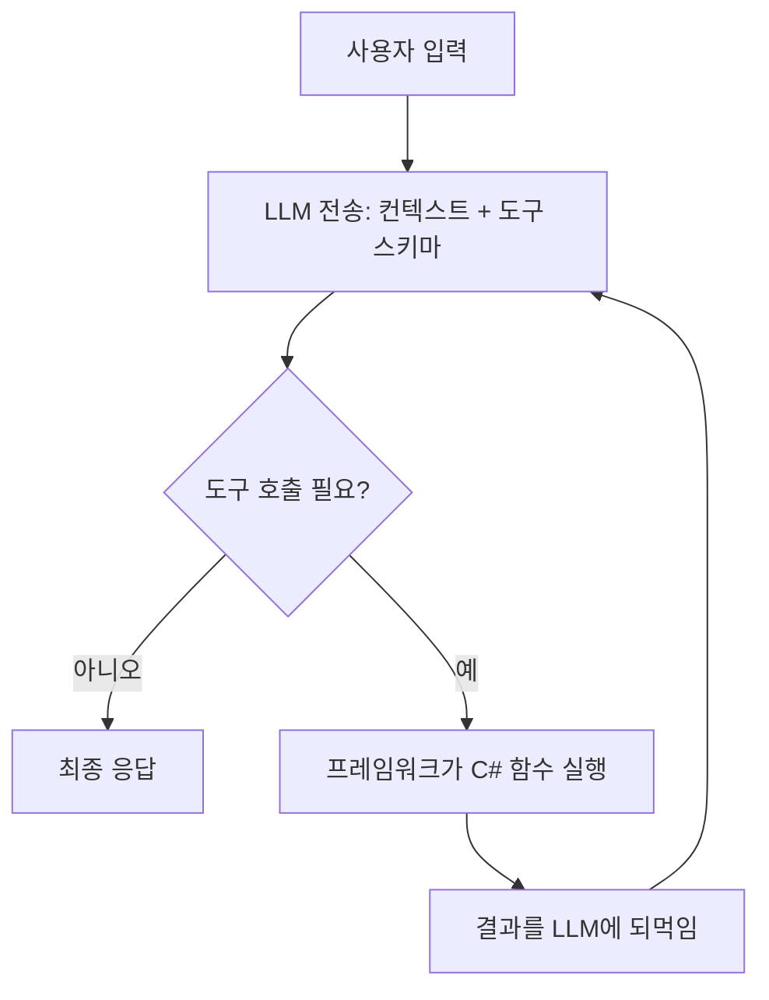
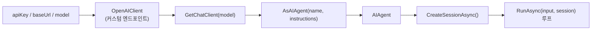
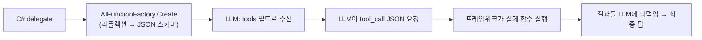
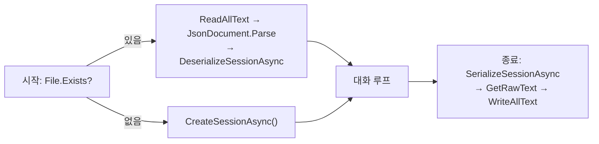
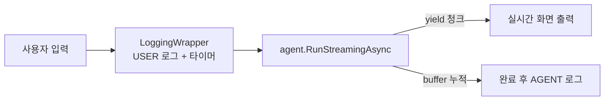
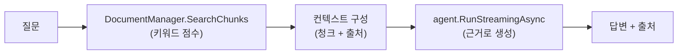
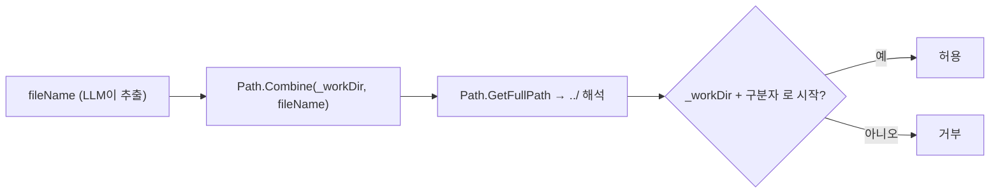
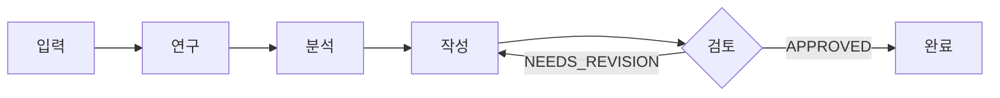

# GameDev AgentOps — 학습 여정 (Microsoft Agent Framework, C#)

> Unity/게임 개발 파이프라인을 위한 C# 기반 AgentOps 툴킷을 만들기 위해,
> Microsoft Agent Framework(MAF)를 chapter 단위로 학습하며 기록한 문서.
> **"무엇을 배웠나"보다 "어떤 문제를 만나 어떻게 해결했나"** 에 초점을 둔다.

| 항목 | 값 |
|---|---|
| 스택 | .NET 10, C#, Microsoft.Agents.AI 1.9.0, OpenAI 호환(OpenRouter) |
| IDE | JetBrains Rider |
| 진행 | chapter01(환경) · chapter02(개념) · chapter03(첫 에이전트) 완료 |

---

## Chapter 01 — 환경 준비

### 배운 것
- **AI Agent의 입출력 구조**: 내 프로그램은 LLM API에 대해 REST *클라이언트*(B선)다. 누가 내 에이전트를 호출하는지(A선, 콘솔/웹/워커)는 별개의 배포 형태일 뿐.
- OpenAI 호환 엔드포인트 3요소: `LLM_API_KEY`(인증) · `LLM_BASE_URL`(목적지) · `LLM_MODEL`(모델 선택).
- 비밀값은 `.env`로 분리하고 `.gitignore`로 추적 제외.

### 트러블슈팅
| 문제 | 원인 | 해결 |
|---|---|---|
| `.env`를 못 읽어 `LLM_API_KEY`가 null | `Env.Load()`는 **현재 작업디렉터리(CWD)** 만 탐색. 실행은 `bin/Debug/net10.0/`에서 도는데 `.env`는 프로젝트/루트에 있음 | `.csproj`에 `<None Update=".env"><CopyToOutputDirectory>PreserveNewest</...>` 로 빌드 시 출력 폴더로 복사 |
| 커밋 직전 API 키 유출 위험 | 실제 `.gitignore`에 `.env` 규칙 부재 (튜토리얼 문서와 디스크 불일치) | `.gitignore`에 `.env`/`*.env` 추가 후 **`git check-ignore`로 실제 무시 여부 검증** |

> **원리 메모 — 작업디렉터리 함정**: 상대경로로 파일을 "쫓아가지" 말고, 파일을 실행 위치 옆으로 "데려와라"(출력 복사). 환경이 바뀌어도 안 깨진다.

---

## Chapter 02 — 핵심 개념

### Agent Loop (에이전트의 본질)
LLM은 텍스트 생성기일 뿐, 함수를 실행하지 못한다. 에이전트 = LLM + **행동(도구 실행) + 반복**.

### 핵심 4개념
1. **Tool Calling 메커니즘** — 프레임워크가 C# delegate를 리플렉션 → JSON 스키마로 LLM에 전달. LLM은 실행이 아니라 `{tool_call}` JSON을 *요청*만 하고, 실제 실행/되먹임은 프레임워크가 한다.
2. **Stateless LLM** — API는 무상태. 멀티턴이 되는 건 매 호출에 **전체 history 재전송**하기 때문. 그 그릇이 Session(구 Thread).
3. **Builder + 제공자 추상화** — OpenRouter/Poe/로컬은 전부 OpenAI 호환이라 차이는 `baseUrl+model+key` 뿐. 정규화하면 `Build()` 이후 코드가 제공자 무관.
4. **Agent vs Workflow** — 실행 순서를 LLM이 정하면 Agent(유연·비결정적), 개발자가 그래프로 못 박으면 Workflow(결정적·감사 가능). QA triage 등 운영 파이프라인은 Workflow.

---

## Chapter 03 — 첫 번째 Agent

### 구현
book 저장소 래퍼를 참고하되 **Raw MAF API로 직접** `AIAgentBuilder`를 작성(내부 학습 목적).

### 트러블슈팅 (이 챕터의 핵심 가치)
| 문제 | 원인 | 해결 |
|---|---|---|
| Rider "Project load failed" | `.sln`이 존재하지 않는 `.csproj`를 가리키는 유령 참조 | 콘솔 프로젝트 정식 추가 + 유령 항목 제거 |
| csproj 편집 후 load 실패 | `</ItemGroup>>` XML 오타, `<None>` 에 `Update` 누락 | 잉여 `>` 제거, `Update=".env"` 지정 |
| **402 Payment Required** | **코드는 정상** — OpenRouter 유료 모델 잔액 0 | HTTP 코드로 위치 진단(402=인증·엔드포인트·모델 OK), `LLM_MODEL=openrouter/free` 전환 |
| 무료 모델 전환 후에도 402 | bin의 `.env` 사본이 stale (증분 빌드가 복사 스킵) | `dotnet clean` 후 재빌드로 사본 갱신 |
| `CreateThread()` 메서드 없음 | 버전 드리프트 — MAF 1.9.0은 Thread→**Session** 개명 | 설치 dll 멤버 직접 확인 → `await CreateSessionAsync()` |
| 대화가 입력에 반응 안 함 | `RunAsync("질문", …)` 리터럴 전송 (input 미사용) | `RunAsync(input, session)` |
| `StateBag.SetValue()` 혼란 | 대화기억 ↔ 커스텀 상태저장 혼동 | history는 session이 자동관리. StateBag은 커스텀 상태(예: Unity 브랜치)용 → 불필요 시 삭제 |

### HTTP 상태코드 진단표 (재사용 가능한 자산)
| 코드 | 의미 | 어디까지 통과 |
|---|---|---|
| 401 | 인증 실패 | 키 틀림 |
| **402** | 결제 필요 | 키·엔드포인트·모델 OK, 잔액만 없음 |
| 404 | 경로 오류 | baseUrl/모델 경로 |
| 429 | 한도 초과 | 인증·결제 OK |
| 200 | 성공 | 전부 |

---

## Chapter 04 — Tools (Tool Calling)

### 핵심 메커니즘
LLM은 **함수 본문을 못 본다.** 등록된 도구의 **이름 + 설명 + 파라미터 정보**만 보고 호출 여부를 결정한다.
`AIFunctionFactory.Create(delegate)`가 리플렉션으로 C# 함수를 JSON 스키마로 변환 → LLM 요청의 `tools` 필드로 전달.

- **설명 = 도구를 위한 프롬프트 엔지니어링.** 이름/설명이 부실하면 LLM이 엉뚱한 도구를 부르거나 안 부른다.
- **인자는 LLM이 자연어에서 추출** → 틀릴 수 있으니 도구 함수 안에서 입력 검증 필요.
- **도구 실행 = 실제 코드 실행** → 부작용·보안 주의(추후 파일 도구는 sandbox 필요).

### 트러블슈팅
| 문제 | 원인 | 해결 |
|---|---|---|
| 외부 날씨 API가 "못 가져옴" | OpenWeatherMap **401 Invalid API key** — 신규 키 활성화 지연(~2h) | 엔드포인트 직접 호출로 실제 상태 확인, 활성화 대기 |
| 진짜 에러가 안 보임 | 도구 `catch`가 401을 평범한 문자열로 뭉갬 | 개발 중엔 `ex.Message`/HTTP 상태코드 노출 |
| `[Description]`이 LLM에 안 감 | `[Description]`을 **등록 안 된 함수**(`GetRealWeather`)에 붙이고, 캐시 래퍼(`GetWeatherCached`)를 등록 | 설명은 **등록 대상 함수**에 붙여야 전달됨 |
| XML 주석(`///`) 무시됨 | 콘솔 프로젝트는 XML 문서파일 미생성 → 런타임 리플렉션으로 못 읽음 | 설명은 `[Description]` 어트리뷰트로 (메타데이터에 남음) |

> 두 번째 외부 API(OpenWeatherMap)는 LLM(OpenRouter)과 **별개의 서비스·별개의 키**. 도구가 또 다른 외부 API를 호출하는 구조를 처음 경험.

---

## Chapter 05 — 대화 흐름 관리 (Session 영속화 / 장기 기억)

### 단기 vs 장기 — 수명이 다른 두 저장
| | 세션(단기) | 메모리 프로바이더(장기) |
|---|---|---|
| 저장 대상 | 이번 대화 **메시지 전체** | 이름·직업 등 **추출된 사실** |
| 기본 수명 | 메모리에만 → 프로세스 종료 시 소멸 | 디스크에 영속 |
| 용도 | "껐다 켜서 **같은 대화 이어가기**" | "**새 대화**에서도 사실 기억" |
| 파일 | `session.json` (별도) | `user001.json` |

- **"장기 기억"의 정체**: 마법이 아니라 — 디스크의 사실을 읽어 **시스템 프롬프트(`instructions`)에 매번 주입**하는 것. LLM은 여전히 stateless.
- **Session은 "소멸하는 것"이 정의가 아님**: 그릇일 뿐, 직렬화하면 영속됨. 휘발 = 기본값, 영속 = 옵션.

### 세션 영속화 (프레임워크 내장)
MAF 1.9.0 내장 API 사용 (수제 `SessionManager` 불필요):

- **Serialize ≠ Save**: `SerializeSessionAsync`는 세션을 **JsonElement로 변환**만. 디스크 저장은 `File.WriteAllText`까지 해야 완성(2단계).
- **복원=시작, 저장=종료**.

### 트러블슈팅
| 문제 | 원인 | 해결 |
|---|---|---|
| 휘발 데이터를 영속 저장소에 혼입 | 세션(대화)을 메모리 프로바이더(프로필)에 욱여넣음 | 세션은 `session.json`으로 **분리**. 목적·수명이 다름 |
| 첫 실행 크래시 | 복원 조건을 `Profile is not null`로 둠(항상 true) → 빈 세션 Parse | 조건을 `File.Exists(sessionPath)`로 |
| `quit` 시 대화 미보존 | 세션 저장을 20턴 압축 블록 안에만 둠 | **루프 종료 직후(끝자리)** 에 저장 추가 |

---

## Chapter 06 — 고급 기능 (Streaming · Middleware)

### Streaming
- `RunAsync`(완성 후 반환) vs **`RunStreamingAsync`**(SSE로 토큰 즉시 청크 전달). 결과는 같고 체감 지연만 다름.
- `await foreach (var update in agent.RunStreamingAsync(input, session))` → `update.Text` 실시간 출력. (타입: `AgentResponseUpdate`)

### Middleware (데코레이터 패턴)
로깅·필터·메트릭 같은 **횡단 관심사**를 에이전트를 "감싸서" 호출 전후에 끼움. `LoggingAgentWrapper`가 `AIAgent`를 품고 `RunStreamingAsync`를 가로채 로그.

### 트러블슈팅
| 문제 | 원인 | 해결 |
|---|---|---|
| `RunStreamAsync` 없음 | 강의 표기 — 1.9.0은 `RunStreamingAsync` | 메서드명 교체 |
| Extended Thinking 코드 안 됨 | `OpenAIAgentClient`/`thinking` dict는 1.9.0/OpenRouter 무관, 무료모델 미지원 | 개념만, 구현 보류 |
| 미들웨어가 로그 안 남김 | 래퍼 선언만 하고 미사용(원본 직접 호출) | 래퍼로 감싸 그걸 통해 호출 |
| 래퍼가 매 턴 새 로그파일 | `new Wrapper()`를 루프 안에서 | 루프 밖 1회 생성 |
| 스트리밍이 통짜로 출력 | 래퍼가 전체 누적 후 `string` 반환 → 스트림 붕괴 | `async IAsyncEnumerable` + `yield return`(누적은 버퍼에) |

> **핵심**: 스트리밍 호출을 감싸는 미들웨어는 **자신도 스트리밍(yield 패스스루)** 이어야 실시간이 유지된다. 결과를 모아 반환하면 블로킹으로 되돌아간다.

---

## Chapter 07 — 실전 RAG (문서 질의응답) ★ MVP 직결

### RAG 원리
LLM은 내 문서를 모름 → **Retrieve(관련 청크 검색) → Augment(프롬프트에 주입) → Generate(근거로 답변)**.
ch05 "장기 기억=사실을 프롬프트에 주입"과 **같은 원리** — 주입 대상이 "검색된 문서 청크"일 뿐.

### 핵심 개념
- **청킹**: 문서를 작게 쪼개 관련 청크만 검색·주입. **overlap**으로 경계에 걸친 내용 손실 방지. chunk size 트레이드오프(크면 토큰낭비, 작으면 맥락끊김).
- **lexical vs semantic**: 이 구현은 **키워드(단어 겹침) 검색** → "비동기"로 "async" 못 찾음. 진짜 품질은 **임베딩 벡터+코사인 유사도**(semantic). 지금은 흐름 학습용.
- **출처 명시**: 검색된 청크의 파일명·인덱스를 답변과 함께 → 환각 방지·신뢰.

### 트러블슈팅
| 문제 | 원인 | 해결 |
|---|---|---|
| 강의 `RunStreamAsync`/`CreateThread`/`object thread` | 1.9.0 불일치 | `RunStreamingAsync`/`CreateSessionAsync`/`AgentSession` |
| async 세션을 생성자에서 초기화 불가 | 생성자는 async 불가 → fire-and-forget `ContinueWith`는 **race condition**(세션 준비 전 사용) | 정적 async 팩토리 또는 **`_session ??= await CreateSessionAsync()` 지연 초기화** |

> **GameDev AgentOps 연결**: `DocumentManager`→Unity 로그/GDD retriever, `DocumentQAAgent`→"이 규칙이 뭐였지?" 출처 답변. 보고서 데모 시나리오 3번 그대로.

---

## Chapter 08 — 업무 자동화 (멀티 도구 + Sandbox 보안) ★ MVP 직결

### 멀티 도구 조합
`FileTools`·`DataTools`·`SystemTools`에서 11개 도구 등록. **인스턴스 메서드 delegate**가 인스턴스를 클로저로 캡처 → 도구가 자기 상태(`_workDir`) 보유. CsvHelper로 CSV 통계.

### ★ 핵심 — 프롬프트 안전 ≠ 코드 강제 (보안 사고방식)
`../OUTSIDE_secret.txt 읽어줘` → 에이전트가 거부했지만, **거부한 건 LLM(프롬프트 지시)이지 코드가 아니었다**. 코드(`Path.Combine`)엔 가드가 없어 여전히 취약 — 표현만 바꾸면 뚫림.
> **신뢰 경계(파일 접근)는 프롬프트로 "부탁"하면 안 되고 코드로 "강제(enforce)"해야 한다.**

### Sandbox(SafePath) 구현

- **base 정규화**: `Path.GetFullPath(baseDir)`.
- **prefix 함정**: `StartsWith(_workDir)`는 형제폴더 `AutomationWorkspace-evil` 통과시킴 → **끝에 `Path.DirectorySeparatorChar` 붙여** 비교(`_workDirPrefix`).
- **defense-in-depth**: `ReadFile`/`WriteFile`/`SearchFiles` 모두 같은 `IsSafePath` 관문 통과.
- 남은 엣지: `GetFullPath`는 심링크 미해석(고급, 보류).

### 트러블슈팅
| 문제 | 원인 | 해결 |
|---|---|---|
| sandbox "주장"만 하고 미구현 | 강의 코드가 `Path.Combine`만 사용, `../` 무방비 | `IsSafePath`(GetFullPath+StartsWith) 추가 |
| 안전해 보였으나 사실 LLM이 거부 | 프롬프트 지시 기반 → 우회 가능 | 코드로 강제 |
| 형제폴더 prefix 우회 | `StartsWith`에 구분자 없음 | base 끝에 구분자 보장 후 비교 |
| 테스트 파일을 못 찾음 | `MyDocuments`가 OneDrive로 리다이렉트(`OneDrive\문서`) | 실제 경로 확인 후 그쪽에 배치 |

---

## Chapter 09 — Multi-Agent Workflow (오케스트레이션) ★ MVP 직결

### 정정: "Workflow" ≠ MAF 네이티브 Workflow
이 챕터의 "Workflow"는 **C#으로 에이전트를 순서대로/병렬로/if-else로 부르는 수작업 오케스트레이션**. MAF의 그래프·체크포인트·HITL Workflow가 아님(보고서가 지적한 부분). 학습엔 더 명료하고, QA triage 같은 결정적 파이프라인엔 충분. 감사·승인 게이트가 필요해지면 네이티브로 승격.

### 핵심 개념
- **에이전트 전문화**: 좁은 시스템 프롬프트(연구/분석/작성/검토) = 프롬프트 분해 → 단계 품질↑·디버깅↑·재사용.
- **단계 간 데이터 전달(stateless)**: 에이전트는 세션 없이 one-shot 호출. **이전 출력을 다음 프롬프트 문자열에 이어붙여** 전달. "에이전트 간 통신"의 정체.
- **3패턴**: 순차(누적+1회 재작성), 병렬(`Task.WhenAll`로 독립작업 동시→합성), 조건(LLM 분류기→코드 분기).
- **병렬의 원리**: `RunAsync`는 호출 즉시 Task 시작 → 배열로 다 띄운 뒤 `await Task.WhenAll`. 각각 `await`하면 순차가 됨.

### 트러블슈팅
| 문제 | 원인 | 해결 |
|---|---|---|
| `RunStreamAsync`/`RunResult` | 1.9.0 불일치 | `RunStreamingAsync`/`AgentResponse` |
| **판정 파싱 취약(`.Contains`)** | LLM 자유텍스트에 단어가 우연히 섞이면 오판정(review·router 양쪽) | 구조화 출력(JSON/enum) 또는 마지막 줄/판정 토큰만 추출 |
| 워크플로 1회에 LLM 다중 호출 | 무료 모델 분당 20회/일 50회 | 429 시 대기 또는 충전 |

> **GameDev AgentOps 연결**: 순차 workflow = 크래시 triage(Collector→Analyzer→Severity). 단, severity 판정을 `.Contains`로 하면 운영 사고 → **구조화 판정 필수**.

---

## 관통하는 교훈

> **"문서·튜토리얼에 적힌 것"이 아니라 "내 환경이 실제로 가진 것"을 확인하라.**

- `.env` → `git check-ignore` 로 실제 무시 여부 확인
- 커밋 → `git add --dry-run` 으로 올라갈 파일 사전 확인
- API 이름 → IntelliSense / 설치 dll 멤버로 실제 시그니처 확인
- 빌드 산출물 → bin의 사본이 최신인지 타임스탬프 확인

AI 프레임워크는 버전 드리프트가 심해, 이 "실물 확인" 습관이 곧 생존 기술이다.

---

## 진행 상태
- chapter01·02·03 완료. 첫 멀티턴 대화 에이전트 **빌드 통과(0 error / 0 warning)**.
- 코드 확정: `RunAsync(input, session)`, 불필요 catch/StateBag 제거, 변수명 `session` 정리.

## 다음 단계
- [ ] `dotnet run` 으로 멀티턴 기억 런타임 검증 ("철수야 → 내 이름?")
- [ ] chapter04: Tool Calling 구현 (delegate → `AIFunctionFactory.Create`)
- [ ] GameDev AgentOps MVP: Unity 로그 파서 · CSV 검증 · 문서 RAG
