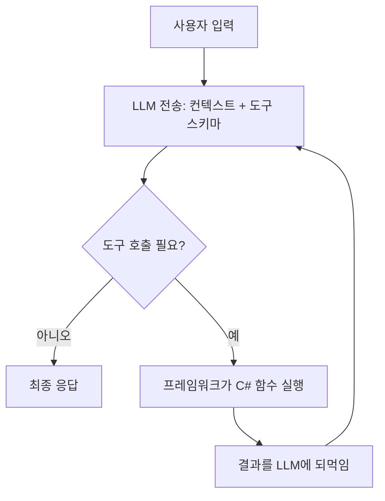
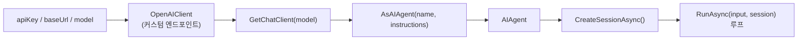

# GameDev AgentOps — 학습 여정 (Microsoft Agent Framework, C#)

> Unity/게임 개발 파이프라인을 위한 C# 기반 AgentOps 툴킷을 만들기 위해,
> Microsoft Agent Framework(MAF)를 chapter 단위로 학습하며 기록한 문서.
> **"무엇을 배웠나"보다 "어떤 문제를 만나 어떻게 해결했나"** 에 초점을 둔다.

| 항목 | 값 |
|---|---|
| 스택 | .NET 10, C#, Microsoft.Agents.AI 1.9.0, OpenAI 호환(OpenRouter) |
| IDE | JetBrains Rider |
| 진행 | chapter01(환경) · chapter02(개념) · chapter03(첫 에이전트) 완료 |

---

## Chapter 01 — 환경 준비

### 배운 것
- **AI Agent의 입출력 구조**: 내 프로그램은 LLM API에 대해 REST *클라이언트*(B선)다. 누가 내 에이전트를 호출하는지(A선, 콘솔/웹/워커)는 별개의 배포 형태일 뿐.
- OpenAI 호환 엔드포인트 3요소: `LLM_API_KEY`(인증) · `LLM_BASE_URL`(목적지) · `LLM_MODEL`(모델 선택).
- 비밀값은 `.env`로 분리하고 `.gitignore`로 추적 제외.

### 트러블슈팅
| 문제 | 원인 | 해결 |
|---|---|---|
| `.env`를 못 읽어 `LLM_API_KEY`가 null | `Env.Load()`는 **현재 작업디렉터리(CWD)** 만 탐색. 실행은 `bin/Debug/net10.0/`에서 도는데 `.env`는 프로젝트/루트에 있음 | `.csproj`에 `<None Update=".env"><CopyToOutputDirectory>PreserveNewest</...>` 로 빌드 시 출력 폴더로 복사 |
| 커밋 직전 API 키 유출 위험 | 실제 `.gitignore`에 `.env` 규칙 부재 (튜토리얼 문서와 디스크 불일치) | `.gitignore`에 `.env`/`*.env` 추가 후 **`git check-ignore`로 실제 무시 여부 검증** |

> **원리 메모 — 작업디렉터리 함정**: 상대경로로 파일을 "쫓아가지" 말고, 파일을 실행 위치 옆으로 "데려와라"(출력 복사). 환경이 바뀌어도 안 깨진다.

---

## Chapter 02 — 핵심 개념

### Agent Loop (에이전트의 본질)
LLM은 텍스트 생성기일 뿐, 함수를 실행하지 못한다. 에이전트 = LLM + **행동(도구 실행) + 반복**.

### 핵심 4개념
1. **Tool Calling 메커니즘** — 프레임워크가 C# delegate를 리플렉션 → JSON 스키마로 LLM에 전달. LLM은 실행이 아니라 `{tool_call}` JSON을 *요청*만 하고, 실제 실행/되먹임은 프레임워크가 한다.
2. **Stateless LLM** — API는 무상태. 멀티턴이 되는 건 매 호출에 **전체 history 재전송**하기 때문. 그 그릇이 Session(구 Thread).
3. **Builder + 제공자 추상화** — OpenRouter/Poe/로컬은 전부 OpenAI 호환이라 차이는 `baseUrl+model+key` 뿐. 정규화하면 `Build()` 이후 코드가 제공자 무관.
4. **Agent vs Workflow** — 실행 순서를 LLM이 정하면 Agent(유연·비결정적), 개발자가 그래프로 못 박으면 Workflow(결정적·감사 가능). QA triage 등 운영 파이프라인은 Workflow.

---

## Chapter 03 — 첫 번째 Agent

### 구현
book 저장소 래퍼를 참고하되 **Raw MAF API로 직접** `AIAgentBuilder`를 작성(내부 학습 목적).

### 트러블슈팅 (이 챕터의 핵심 가치)
| 문제 | 원인 | 해결 |
|---|---|---|
| Rider "Project load failed" | `.sln`이 존재하지 않는 `.csproj`를 가리키는 유령 참조 | 콘솔 프로젝트 정식 추가 + 유령 항목 제거 |
| csproj 편집 후 load 실패 | `</ItemGroup>>` XML 오타, `<None>` 에 `Update` 누락 | 잉여 `>` 제거, `Update=".env"` 지정 |
| **402 Payment Required** | **코드는 정상** — OpenRouter 유료 모델 잔액 0 | HTTP 코드로 위치 진단(402=인증·엔드포인트·모델 OK), `LLM_MODEL=openrouter/free` 전환 |
| 무료 모델 전환 후에도 402 | bin의 `.env` 사본이 stale (증분 빌드가 복사 스킵) | `dotnet clean` 후 재빌드로 사본 갱신 |
| `CreateThread()` 메서드 없음 | 버전 드리프트 — MAF 1.9.0은 Thread→**Session** 개명 | 설치 dll 멤버 직접 확인 → `await CreateSessionAsync()` |
| 대화가 입력에 반응 안 함 | `RunAsync("질문", …)` 리터럴 전송 (input 미사용) | `RunAsync(input, session)` |
| `StateBag.SetValue()` 혼란 | 대화기억 ↔ 커스텀 상태저장 혼동 | history는 session이 자동관리. StateBag은 커스텀 상태(예: Unity 브랜치)용 → 불필요 시 삭제 |

### HTTP 상태코드 진단표 (재사용 가능한 자산)
| 코드 | 의미 | 어디까지 통과 |
|---|---|---|
| 401 | 인증 실패 | 키 틀림 |
| **402** | 결제 필요 | 키·엔드포인트·모델 OK, 잔액만 없음 |
| 404 | 경로 오류 | baseUrl/모델 경로 |
| 429 | 한도 초과 | 인증·결제 OK |
| 200 | 성공 | 전부 |

---

## 관통하는 교훈

> **"문서·튜토리얼에 적힌 것"이 아니라 "내 환경이 실제로 가진 것"을 확인하라.**

- `.env` → `git check-ignore` 로 실제 무시 여부 확인
- 커밋 → `git add --dry-run` 으로 올라갈 파일 사전 확인
- API 이름 → IntelliSense / 설치 dll 멤버로 실제 시그니처 확인
- 빌드 산출물 → bin의 사본이 최신인지 타임스탬프 확인

AI 프레임워크는 버전 드리프트가 심해, 이 "실물 확인" 습관이 곧 생존 기술이다.

---

## 진행 상태
- chapter01·02·03 완료. 첫 멀티턴 대화 에이전트 **빌드 통과(0 error / 0 warning)**.
- 코드 확정: `RunAsync(input, session)`, 불필요 catch/StateBag 제거, 변수명 `session` 정리.

## 다음 단계
- [ ] `dotnet run` 으로 멀티턴 기억 런타임 검증 ("철수야 → 내 이름?")
- [ ] chapter04: Tool Calling 구현 (delegate → `AIFunctionFactory.Create`)
- [ ] GameDev AgentOps MVP: Unity 로그 파서 · CSV 검증 · 문서 RAG
